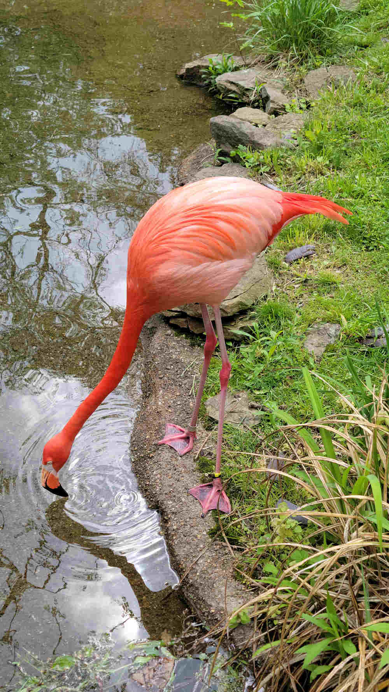

# Pittsburgh Zoo 
A gorgeous, outdoor park style zoo. Animals from around the world preserved and cared for by expert staff.  There's a lot of fun to be had at the zoo, and I highly recommend it as a day trip to anyone.

## What to Expect 
Pittsburgh Zoo is located along the North River, on top of the Highland Park. Asphalt pathways snaking up and down the forested hills. Be prepared for a bit cardio on scenic walk along a journey through the park.

## Essentials to Bring
Don't forget to pack these few things, and you will find your Zoo trip to be mountains more enjoyable.
- Sunscreen
- Hats for sun shade
- Umbrellas (_check your weather forecast_)
- Reusable Water Bottles 
    - Park Water fountains Available with bottle fill styles occasionally 
- **_Optional_**  
While not strictly necessary, taking along these extras will enhance your experience and save you money
- Packed Bag Lunches
- Binoculars (Low Medium magnifying)
- Comfortable Bag  
_Go ahead and anything else that you find to enhance your personal confort at a park, take along, just check against the park's guidelines [here](https://www.pittsburghzoo.org/plan-your-visit/zoo-information/)_  
## Your Time
Plannibg on how long you plan to stay at the park is a matter of how long you want to stay at each exhibit. I find that  on average, 5 hours can get you a leisurely trip around to all the major attractions with time for lunch.  
The park is opened from 9:30 am to 5:30 pm. Members can enter the park 30 minutes early.  

    
    

Hello baby

    

